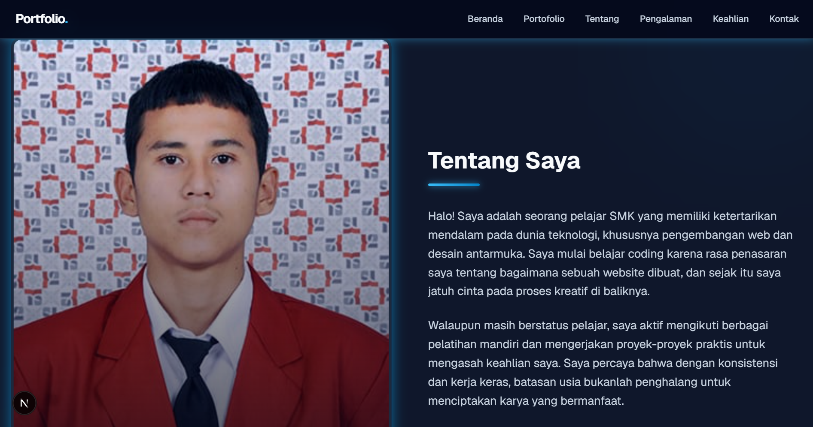
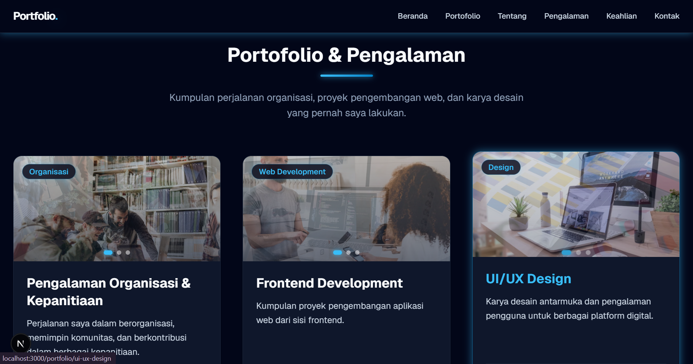
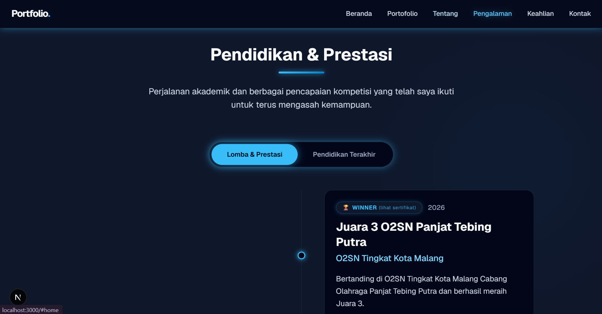
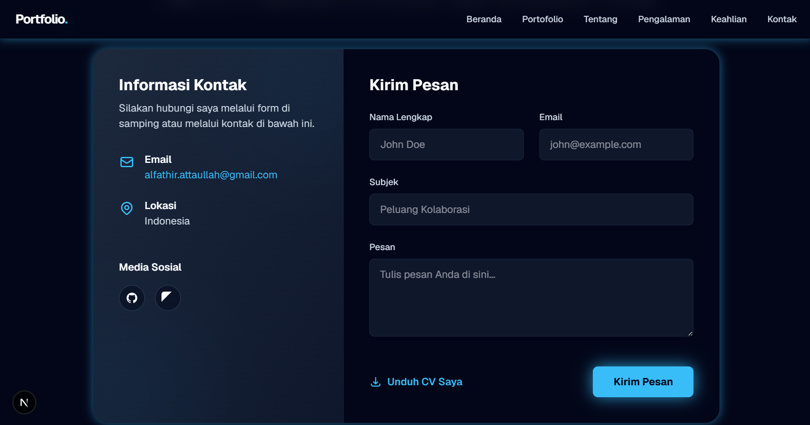

# 🌐 My Personal Portfolio Website

Website ini dibuat sebagai platform digital untuk menampilkan perjalanan profesional, keahlian, pengalaman kerja, serta berbagai prestasi yang telah saya raih. Melalui website ini, pengunjung dapat mengenal saya lebih dekat dan terhubung langsung untuk potensi kolaborasi atau kerja sama.

Website ini sepenuhnya responsif, cepat, dan dibangun menggunakan teknologi web modern.

## 🔗 Live Demo
Kamu bisa melihat portofolio online saya di sini:  
🚀 **[Lihat Website Portofolio Saya](https://link-vercel-atau-netlify-kamu.com)** *(Ganti dengan link live demo kamu jika sudah di-deploy)*

---

## 🛠️ Teknologi yang Digunakan (Tech Stack)

*   **Framework:** [Next.js](https://nextjs.org/) (React Framework)
*   **Bahasa Pemrograman:** [TypeScript](https://www.typescriptlang.org/) (Static Typing untuk kode yang lebih aman)
*   **Styling & UI:** [Tailwind CSS](https://tailwindcss.com/) (Utility-first CSS framework untuk desain responsif)
*   **Deployment:** [Vercel](https://vercel.com/) *(Atau ganti dengan platform yang kamu gunakan)*

---

## ✨ Fitur Utama & Halaman

Website portofolio ini terdiri dari beberapa section dan halaman interaktif:

*   **🏠 Beranda (Home):** Halaman utama yang berisi perkenalan singkat, *headline* profesi, dan ringkasan tentang siapa saya.
*   **💼 Portofolio & Pengalaman:** Menampilkan daftar proyek yang pernah saya kerjakan beserta detail teknologi yang digunakan dan riwayat pengalaman kerja/organisasi.
*   **🏆 Lomba & Prestasi:** Halaman khusus yang mendokumentasikan pencapaian, sertifikasi, serta kompetisi yang pernah saya ikuti.
*   **🎓 Pendidikan & Keahlian:** Informasi mengenai latar belakang pendidikan terakhir serta visualisasi dari *tech stack* atau keahlian teknis yang saya kuasai.
*   **📧 Kontak:** Halaman interaktif yang menyediakan akses bagi pengunjung, *recruiter*, atau klien untuk menghubungi saya secara langsung.

---

## 📸 Tampilan Tampilan Website (Screenshots)

Berikut adalah beberapa tampilan halaman utama dari website portofolio ini:

| 🏠 Beranda & Tentang Saya | 💼 Portofolio & Pengalaman |
| --- | --- |
|  |  |

| 🏆 Lomba & Pendidikan | 📧 Halaman Kontak |
| --- | --- |
|  |  |

---

## 💻 Cara Menjalankan Proyek di Lokal

Jika kamu ingin melakukan *clone* proyek ini dan menjalankannya di komputer lokalmu, silakan ikuti langkah-langkah di bawah ini:

### Prasyarat
Pastikan kamu sudah menginstal [Node.js](https://nodejs.org/) di komputermu.

### Langkah-langkah
1. **Clone repositori ini**
   ```bash
   git clone [https://github.com/AlFathirAtta/WebPortfolio.git](https://github.com/AlFathirAtta/WebPortfolio.git)
2. **Masuk ke dalam direktori proyek**
   ```bash
   cd WebPortfolio
3. **Instal semua dependensi yang dibutuhkan**
   ```bash
   npm install
4. **Jalankan aplikasi dalam mode pengembangan (development)**
   ```bash
   npm run dev

Buka browser kamu dan akses `http://localhost:3000` untuk melihat hasilnya.

---

## 📄 Lisensi
Proyek ini dilisensikan di bawah **MIT License**. Kamu bebas memodifikasi dan menggunakan kode ini untuk keperluan portofolio pribadimu.
